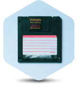

Courses I currently teach or have taught at UC San Diego, covering experimental design, statistics, data science, and foundational biology.

## Featured: BILD 5 — Data Analysis and Design for Biologists

::: {.callout-note appearance="simple" icon=false}
{fig-alt="Floppy disk icon representing data and computing" width=120px}

**A required course for all UC San Diego biology majors**, co-developed with [Liam O'Connor Mueller](https://biology.ucsd.edu/research/faculty/lomueller).

BILD 5 is a four-credit introduction to information literacy, experimental design, and quantitative analysis in R. It is designed for students with no prior coding, math, or lab experience. The course includes a scaffolded term project, a browser-based coding environment that runs on any device, and a generative AI policy built around transparent use on assignments and closed-book assessments for exams.

[ **Go to BILD 5 — course page & syllabus**](classes/BILD_5.qmd){.btn .btn-primary .btn-lg}
:::

## Other courses

::: {#classes}
:::